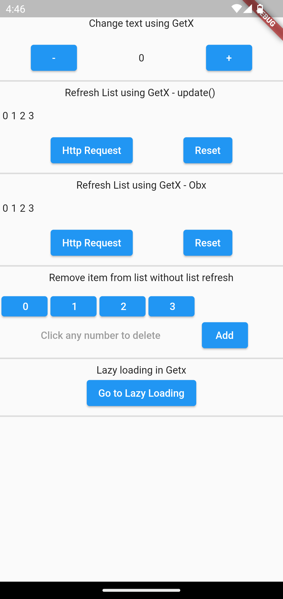
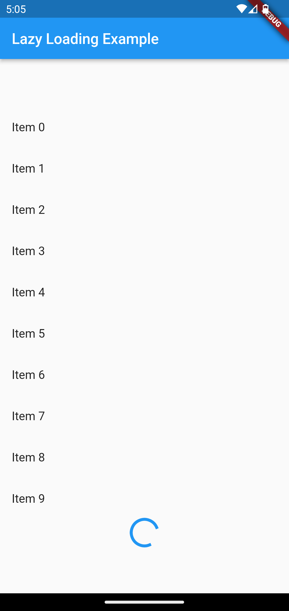

# GetX Example

Sample project for Getx State Management

## Description

This Flutter app showcases stage management using GetX

## Screenshots

<p align="center">
  
  
</p>


## Features

- Feature 1: How to change the text's value using GetX
- Feature 2: How to refresh a list using Getx - update() method
- Feature 3: How to refresh a list using Getx - Obx() method
- Feature 4: How to remove an item from a list using GetX
- Feature 5: LazyLoading using Getx

## Getting Started

1. Clone the repository:

   ```shell
   git clone https://github.com/anandh-ps/getx_example
